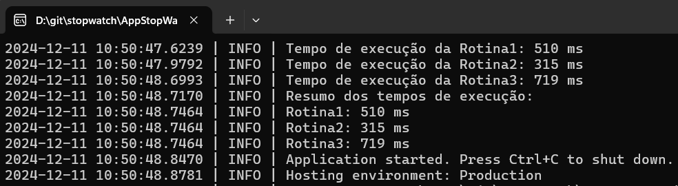

# StopWatch + NLog
Stopwatch para monitorar várias rotinas. A estratégia envolve pausar (Stop) e retomar (Start) o cronômetro entre as execuções das rotinas, armazenando os tempos intermediários em variáveis ou uma estrutura de dados.
Adicionado NLog para registro de execução no nível INFO.

